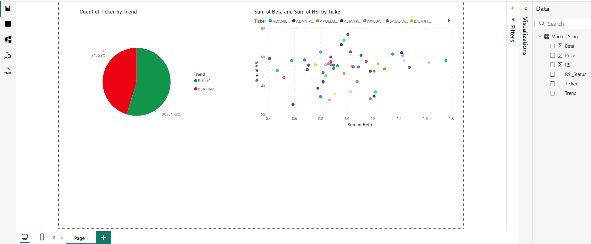

# 📈 Automated Nifty 50 Risk Dashboard

## 🚀 Project Overview
A quantitative finance tool that automates the daily screening of Indian Equities (NSE). It uses Python to calculate live risk metrics (Beta, RSI) and feeds the data into an interactive **Power BI Dashboard**.

## 📊 The Dashboard
*(This interactive dashboard updates automatically with one click)*


## 🛠️ Key Features
* **Automated Pipeline:** Python script fetches live data and calculates **RSI** & **Beta** manually (no external libraries).
* **Excel Integration:** Auto-generates a color-coded Excel report (`Pro_Dashboard.xlsx`) for quick scanning.
* **Power BI Feed:** Outputs a cleaned CSV dataset that instantly refreshes the Power BI visuals.

## 💻 Tech Stack
* **Python:** Pandas, NumPy, yfinance
* **Visualization:** Power BI, Seaborn
* **Automation:** XlsxWriter

## ⚡ How to Run
1. Install dependencies:
   ```bash
   pip install -r requirements.txt
